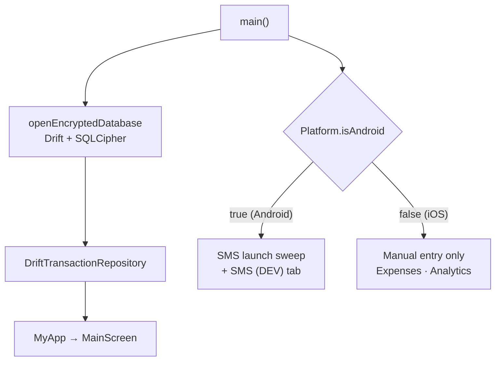

# Fynans for iOS — Prototype Delivery Plan & Build Guide

| | |
|---|---|
| **Document** | iOS prototype: product scope, delivery milestones, and build guide |
| **Version** | 2.0 (supersedes the Hive-era iOS plan) |
| **Status** | Active. M0, M1, M3 done; M2/M4/M5 paused by choice — resuming later |
| **Last updated** | 2026-09-13 |
| **Integration branch** | `ios_build` (cut from `main` @ `51eb16c`) |
| **Target** | iOS Simulator (iOS 26.x runtime), deployment target iOS 13.0 |
| **Estimated effort** | ~5 engineering days |

Fynans is a private, on-device personal finance tracker. On Android it imports
bank transactions automatically from SMS. This document defines the **iOS
prototype**, a manual-entry edition built from the same Flutter codebase. It
covers the scope, the milestones and tasks needed to deliver it, and the
technical detail an engineer needs to build, test, and ship each task.

---

## Contents

1. [Overview](#1-overview)
2. [Product Scope](#2-product-scope)
3. [Technical Overview](#3-technical-overview)
4. [Development Environment](#4-development-environment)
5. [Delivery Plan: Milestones & Tasks](#5-delivery-plan-milestones--tasks)
6. [Implementation Guide](#6-implementation-guide)
7. [Testing Strategy](#7-testing-strategy)
8. [Engineering Workflow](#8-engineering-workflow)
9. [Risks & Mitigations](#9-risks--mitigations)
10. [Troubleshooting](#10-troubleshooting)
11. [Post-Prototype Roadmap](#11-post-prototype-roadmap)
12. [Reference: Key Files](#12-reference-key-files)
13. [Document History](#13-document-history)

---

## 1. Overview

### 1.1 Background

Fynans' Android app reads the SMS inbox, parses bank-transaction messages, and
records them automatically. **iOS does not allow third-party apps to read the
Messages inbox.** This is a platform sandbox rule, and no entitlement or
permission unlocks it. The only SMS-related extension point on iOS, the SMS
Filter Extension, sees only messages from unknown senders and can't pass
message content to the host app.

So the iOS edition starts as a **manual-entry personal finance tracker**. It is
built from the same codebase, UI and encrypted storage as Android, with the SMS
automation left out.

### 1.2 Goals

- Deliver a working iOS build of Fynans that runs on the iOS Simulator.
- Offer the full manual-tracking experience: add, review, filter, analyse and
  delete transactions, with the same UI and design system as Android.
- Keep financial data **encrypted at rest** on iOS, as it is on Android.
- Guarantee that **no SMS code path runs on iOS**.
- Leave **Android behaviour unchanged**.

### 1.3 Non-goals (this delivery)

- Any form of SMS intake on iOS (paste, share, or automatic). See §11.
- Physical-device installs, code signing, TestFlight, or App Store submission.
- Credit-card tracking. It lives on `feature/credit-cards` and hasn't been merged.
- Cloud sync, backup/restore, or multi-device support.
- A Cupertino (native iOS widget) redesign. The Material UI ships as-is.

### 1.4 Success criteria

The prototype is complete when all of the following hold:

1. A clean checkout of `ios_build` builds and runs on the iOS Simulator by
   following §4.
2. The database on iOS is verifiably encrypted at rest (§6.3).
3. No SMS code executes on iOS: no launch sweep, no SMS screen, and no
   permission request.
4. All P1 QA test cases in §7.2 pass, and there are no open P1 defects.
5. On Android, `flutter test` is green, the APK builds, and SMS import still
   works.
6. The work is merged into `main` and tagged, and release notes are published (M5).

---

## 2. Product Scope

### 2.1 Feature parity

| Capability | Android | iOS prototype |
|---|---|---|
| Add a transaction: amount, date, direction (debit/credit), tags, party, group, note | Yes | Yes |
| Autocomplete for party and group from past entries | Yes | Yes |
| Monthly transaction list, **Simple** and **Advanced** (hierarchical) views | Yes | Yes |
| Tap to expand transaction details; swipe to delete | Yes | Yes |
| Filters, date-range presets, month/year picker | Yes | Yes |
| Analytics: flow summary, daily spending, spending by tag | Yes | Yes |
| Light / dark / system theme | Yes | Yes |
| Encrypted on-device storage (Drift + SQLCipher) | Yes (Android Keystore key) | Yes (iOS Keychain key) |
| Automatic SMS import at launch | Yes | **No**: iOS blocks it |
| SMS parsing developer screen (`SMS (DEV)` tab) | Yes | **No** |
| Credit cards | Unmerged branch | No (roadmap F4) |
| Edit an existing transaction | No | No (roadmap F5) |
| Cloud sync / backup | No | No |

Because the same Dart code runs on both platforms, the screens, theme, Iosevka
typography and `en_IN` ₹ formatting are identical. On iOS, Flutter also applies
its standard platform adaptations automatically: slide page transitions, edge
swipe-back, bouncing scroll physics, and iOS text-selection handles.

### 2.2 Known limitations of the prototype

- **Manual entry only.** Every transaction is typed in by hand.
- **Simulator only.** The app isn't signed, so it can't be installed on a
  physical device yet.
- **Placeholder app identity:** bundle identifier `com.example.fynans` and the
  default Flutter app icon.
- **Single device:** no backup, restore or sync.

---

## 3. Technical Overview

### 3.1 Codebase layout

Fynans uses a hexagonal (ports-and-adapters) layout on **Drift + SQLCipher**.

> Note: `CLAUDE.md` and `README.md` still describe an earlier Hive-based
> design. Treat the code as the source of truth. Task M5.3 refreshes these docs.

```
lib/
  entities/          Pure domain models (Transaction, filters, summaries)
  ports/             Abstract interfaces (TransactionRepository, SecretKeyStore, ...)
  use_cases/         Pure business logic (hierarchy building, analytics, parsing)
  adapters/
    data/            Drift database, SQLCipher setup, keystore, settings
    sms/             SMS inbox reader, parser, ingestor (inbox read is Android-only)
    blocs/           Cubits/Blocs (flutter_bloc)
  ui/                Screens, widgets, theme
  main.dart          Composition root
```

### 3.2 Runtime flow (after M3)



### 3.3 Storage and encryption

- **SQLCipher linkage.** `pubspec.yaml` selects the SQLCipher build through
  `hooks.user_defines.sqlite3.source: sqlcipher`. The build hook in `sqlite3`
  3.5.0 downloads a prebuilt, hash-verified `libsqlcipher` for each target,
  including the iOS Simulator slices (`arm64.ios_sim`, `x64.ios_sim`). **The
  first build requires network access.**
- **Fail-closed guard.** In `lib/adapters/data/encrypted_database.dart`,
  `_configure` runs `PRAGMA cipher_version` and throws `DatabaseNotEncrypted`
  if it returns no rows. The app therefore can't start on a plaintext SQLite
  build: a successful launch proves encryption is active.
- **Key management.** A 256-bit key is generated on first run and stored by
  `lib/adapters/data/keystore_secret_key_store.dart` through
  `flutter_secure_storage`: the Android Keystore on Android, the Keychain on
  iOS. No iOS-specific code is needed.

### 3.4 Platform-specific code paths

Only two places in the codebase reach Android-only APIs:

| Location | What it does | Plan |
|---|---|---|
| `lib/main.dart` | Calls `SmsIntakeService.catchUp(repository)` after launch | Gate on the platform (M3.2) |
| `lib/ui/main_screen.dart` | Registers the `SMS (DEV)` destination and `TestSmsScreen` page | Drop both on iOS (M3.3) |

Everything under `lib/adapters/sms/` is reachable only through these two entry
points. The SMS parser itself (`SmsParserService`, `TransactionSmsIngestor`) is
pure Dart and platform-neutral.

> **Important: the `IndexedStack` pitfall.** `MainScreen` hosts its pages in an
> `IndexedStack`, which builds **every** child at startup, visible or not.
> `TestSmsScreen.initState` reads the inbox immediately
> (`ReadSmsService.getAllSms()`, which uses `permission_handler` and
> `flutter_sms_inbox`). Hiding only the tab is therefore not enough: the page
> must be left out of the page list.

**Plugin notes:**
- `flutter_sms_inbox` 1.0.5 declares only an Android implementation. Its Dart
  API compiles on iOS but fails at runtime, so a runtime gate is enough and no
  conditional import is needed.
- `permission_handler` has no SMS permission on iOS.
- `flutter_secure_storage`, `path_provider` and `shared_preferences` all
  support iOS.

### 3.5 iOS project baseline (on `main`)

| Item | Value |
|---|---|
| Bundle identifier | `com.example.fynans` (placeholder) |
| Display name | `Fynans` |
| Deployment target | 12.0 on `main`; Flutter's migrator raises it to **13.0** in M2 |
| Dependency managers | CocoaPods (not yet committed) plus Swift Package Manager (Flutter 3.44 default) |
| App delegate | Stock `FlutterAppDelegate` |
| Orientations | Portrait and landscape (matches Android, which doesn't lock orientation) |
| Line endings | iOS project files are committed with **CRLF**. Xcode and CocoaPods rewrite them as LF |

---

## 4. Development Environment

### 4.1 Prerequisites

| Tool | Version verified | Notes |
|---|---|---|
| macOS | 26.x | Required for iOS builds |
| Xcode | 26.6 (17F113), iOS 26.5 SDK | Includes the command-line tools |
| iOS Simulator runtime | 26.x | Separate download from Xcode (several GB). See M1.2 |
| Flutter | 3.44.4 stable (Dart 3.12.2) | `flutter doctor -v` must pass for iOS |
| CocoaPods | 1.17.0 | Homebrew or RubyGems |
| Android SDK / JDK | As in `README.md` | Needed for Android regression builds |

Your shell must use a UTF-8 locale, or CocoaPods warns or fails:

```bash
export LANG=en_US.UTF-8   # add to ~/.zshrc
```

### 4.2 Quick start (once M2 and M3 have landed)

```bash
git checkout ios_build
flutter pub get
open -a Simulator
flutter devices                   # note the iOS simulator id
flutter run -d <simulator-id>
```

### 4.3 Common commands

| Purpose | Command |
|---|---|
| Static analysis | `flutter analyze` |
| Unit and widget tests | `flutter test` |
| iOS Simulator build (no signing) | `flutter build ios --simulator --debug` |
| Run on a simulator | `flutter run -d <simulator-id>` |
| Android regression build | `flutter build apk --debug` |
| Clean all build output | `flutter clean && flutter pub get` |

---

## 5. Delivery Plan: Milestones & Tasks

### 5.1 Milestone overview

| ID | Milestone | Outcome | Estimate | Depends on | Status |
|---|---|---|---|---|---|
| **M0** | Project Setup | Clean integration branch with this plan committed and published | 0.25 d | — | Done (branch not yet pushed — M0.4 open) |
| **M1** | Development Environment | iOS toolchain ready; simulator available | 0.5 d | M0 | Done |
| **M2** | iOS Platform Bring-up | App builds and launches on the Simulator with encrypted storage | 1 d | M1 | Not started (paused by choice; blocked on disk space when last attempted) |
| **M3** | Platform Adaptation | Manual-entry mode on iOS; SMS paths gated; tests added | 1 d | M0 | Done, on `ios/m3-platform-gating` (not yet merged/pushed) |
| **M4** | Quality Assurance | QA suite passes on iOS; Android regression verified | 1.5 d | M2, M3 | Not started (paused by choice) |
| **M5** | Prototype Release | Merged to `main`, tagged, documented, demo-ready | 0.75 d | M4 | Not started (paused by choice) |

**Critical path:** M0 → M1 → M2 → M4 → M5. M3 is pure Dart and can run in
parallel with M1 and M2. Only its simulator verification needs M2.

### 5.2 M0 — Project Setup

**Objective:** a clean, shared starting point for iOS work.

| ID | Task | Acceptance criteria | Est. | Status |
|---|---|---|---|---|
| M0.1 | Create the integration branch `ios_build` from `main` | Branch exists at `main` @ `51eb16c` | 0.25 h | Done (2026-09-11) |
| M0.2 | Reset iOS/macOS project files to the `main` baseline ([§6.1](#61-baseline-reset-m02)) | `git status` shows no changes under `ios/` or `macos/` | 0.5 h | Done (2026-09-12) — note: `flutter pub get` regenerates the `ios/` CocoaPods include lines as a side effect every time it runs; that's expected (it's a subset of M2.1) and was left in place. `macos/` was restored each time it drifted, since macOS is out of scope |
| M0.3 | Commit this plan (`IOS_PLAN.md`) to `ios_build` | Plan is tracked on the branch | 0.25 h | Done (2026-09-12) — `f85b25c` |
| M0.4 | Publish `ios_build` to `origin` | Branch is visible on the remote for contributors | 0.25 h | Not started — holding until Rahul's tester session signs off |

**Exit criteria:** `ios_build` is on the remote, contains this plan, and has no
leftover generated iOS/macOS files.

### 5.3 M1 — Development Environment

**Objective:** every contributor can build for the iOS Simulator.

| ID | Task | Acceptance criteria | Est. | Status |
|---|---|---|---|---|
| M1.1 | Audit the toolchain against §4.1 | `flutter doctor -v` shows no iOS errors other than a missing simulator | 0.5 h | Done (2026-09-12) — Xcode 26.6 (17F113), Flutter 3.44.4, CocoaPods 1.17.0 all matched §4.1 |
| M1.2 | Install the iOS 26.x Simulator runtime ([§6.2](#62-simulator-runtime-m12m13)) | `xcrun simctl list runtimes` lists an iOS runtime | 2 h | Done (2026-09-13) — iOS 26.5 (23F77) installed. Two attempts failed first on "Insufficient space available" (needs 8.49 GB); succeeded after Rahul freed disk space |
| M1.3 | Provision simulator devices: a current iPhone and a compact one (e.g. iPhone SE) | Both appear in `xcrun simctl list devices available` | 0.5 h | Done (2026-09-13) — Xcode's default device set already included iPhone 17 and iPhone 17e (this generation's compact/budget model), satisfying the requirement with no extra creation needed |
| M1.4 | Configure a UTF-8 shell locale for CocoaPods | `pod --version` prints without an encoding warning | 0.25 h | Done (2026-09-12) — `pod --version` printed cleanly with no encoding warning |

**Exit criteria:** `flutter devices` lists at least one iOS simulator.

### 5.4 M2 — iOS Platform Bring-up

**Objective:** the unmodified app builds, launches and stores data securely on iOS.

| ID | Task | Acceptance criteria | Est. | Status |
|---|---|---|---|---|
| M2.1 | Generate the iOS build integration (CocoaPods + SPM) with a simulator build ([§6.3](#63-ios-build-integration-m21m25)) | `flutter build ios --simulator --debug` succeeds | 2 h | Not started |
| M2.2 | Pin the CocoaPods platform to iOS 13.0 in `ios/Podfile` | Rebuild succeeds with no deployment-target warnings from pods | 0.25 h | Not started |
| M2.3 | First launch on the Simulator | App reaches the Expenses screen; no `DatabaseNotEncrypted` or `SqliteException` | 2 h | Not started |
| M2.4 | Verify encryption at rest on iOS | The `fynans.db` header is not `SQLite format 3` | 0.5 h | Not started |
| M2.5 | Review and commit the generated iOS project changes | Only the expected `ios/` files are committed; `flutter test` is green | 1 h | Not started |

**Exit criteria:** the app runs on the Simulator with encrypted storage, and the
iOS project integration is committed.

> Before M3 lands, the SMS paths still run on iOS. A `MissingPluginException`
> in the console or an empty `SMS (DEV)` tab at this stage is expected and not
> a defect.

### 5.5 M3 — Platform Adaptation (manual-entry mode)

**Objective:** iOS runs as a manual-entry tracker with no SMS code paths.
Android is unaffected.

| ID | Task | Acceptance criteria | Est. | Status |
|---|---|---|---|---|
| M3.1 | Add a platform capability flag (`smsInboxAvailable`) at the composition root ([§6.4](#64-platform-gating-m31m33)) | Flag is derived once in `main.dart` and passed down explicitly | 0.5 h | Done (2026-09-12) — `38b7927` |
| M3.2 | Gate the launch SMS sweep on the flag | `SmsIntakeService.catchUp` is never called on iOS | 0.25 h | Done (2026-09-12/13) — `38b7927` gates the call site in `main.dart`; `0b486c9` additionally guards inside `SmsIntakeService.catchUp` itself (`if (!Platform.isAndroid) return 0;`) so the pipeline refuses to run on iOS regardless of caller, not just via the call-site check |
| M3.3 | Make the `MainScreen` destinations and pages conditional (`showSmsTab`) | iOS shows **Expenses** and **Analytics** only; `TestSmsScreen` is never built | 2 h | Done (2026-09-12) — `38b7927` |
| M3.4 | Widget tests for both shell configurations ([§6.5](#65-widget-tests-m34)) | `test/ui/main_screen_test.dart` covers `showSmsTab` true and false | 3 h | Done (2026-09-12) — `38b7927` |
| M3.5 | Android regression build | `flutter analyze` clean, `flutter test` green, `flutter build apk --debug` succeeds | 0.5 h | Done (2026-09-12/13) — verified after both `38b7927` and `0b486c9`: analyze clean, all 178 tests pass, `flutter build apk --debug` succeeds |

**Exit criteria:** on the Simulator there are two tabs and no SMS or permission
activity in the console. All checks pass.

### 5.6 M4 — Quality Assurance

**Objective:** confirm the prototype works end to end on iOS and that Android
hasn't regressed.

| ID | Task | Acceptance criteria | Est. | Status |
|---|---|---|---|---|
| M4.1 | Run the QA suite (§7.2) on the primary simulator | Every P1 case passes | 4 h | Not started |
| M4.2 | Device-matrix and layout pass: compact device, notch/Dynamic Island, landscape, keyboard | TC-14 to TC-16 pass on both devices | 2 h | Not started |
| M4.3 | Fix iOS-specific defects found in M4.1 and M4.2 | Each fix is its own commit with a regression note; open P1 count is zero | 4 h | Not started |
| M4.4 | Android regression pass | TC-18 passes; SMS import verified on a device where available | 1 h | Not started |
| M4.5 | Record known issues | Open P2/P3 defects listed in the release notes with severity | 1 h | Not started |

**Exit criteria:** all P1 cases pass on iOS, Android has no regressions, and
known issues are documented.

### 5.7 M5 — Prototype Release

**Objective:** a reviewed, documented, demo-ready prototype on `main`.

| ID | Task | Acceptance criteria | Est. | Status |
|---|---|---|---|---|
| M5.1 | Write release notes: features, limitations, known issues, run instructions | Release notes published with the PR | 1 h | Not started |
| M5.2 | Capture demo assets: screenshots of Expenses, Add, Analytics, in light and dark | Assets attached to the PR or release | 1 h | Not started |
| M5.3 | Refresh developer docs: add iOS setup to `README.md`; correct the stale Hive references in `README.md` and `CLAUDE.md` | Docs match the Drift + SQLCipher architecture and include iOS instructions | 2 h | Not started |
| M5.4 | Open a pull request from `ios_build` to `main`, review and merge ([§9](#9-risks--mitigations), R4) | PR approved; CI or local checks green; merged | 2 h | Not started |
| M5.5 | Tag the release `ios-prototype-v0.1.0` | Tag pushed to `origin` | 0.25 h | Not started |

**Exit criteria:** the prototype is on `main`, tagged, with release notes and
up-to-date docs.

---

## 6. Implementation Guide

### 6.1 Baseline reset (M0.2)

Earlier build attempts may have left generated files in a working copy (for
example `ios/Podfile` or an edited `project.pbxproj`). Return `ios/` and
`macos/` to the committed baseline:

```bash
git status --short ios macos                     # review before discarding
git restore ios macos
rm -f ios/Podfile ios/Podfile.lock macos/Podfile
rm -rf ios/Pods macos/Pods
flutter clean && flutter pub get
```

If `origin/main` has moved past `51eb16c` and nothing has been committed on
`ios_build` yet, re-cut the branch:

```bash
git checkout main && git pull --ff-only && git checkout -B ios_build
```

### 6.2 Simulator runtime (M1.2–M1.3)

Install the runtime from **Xcode → Settings → Components**, or from the
command line:

```bash
xcodebuild -downloadPlatform iOS     # several GB
# If it reports pending first-launch tasks:
xcodebuild -runFirstLaunch
```

Xcode normally creates a default set of devices along with the runtime. To add
one yourself:

```bash
xcrun simctl list devicetypes        # find the device type id
xcrun simctl list runtimes           # find the runtime id
xcrun simctl create "iPhone SE" <device-type-id> <runtime-id>
open -a Simulator
flutter devices
```

### 6.3 iOS build integration (M2.1–M2.5)

1. **Generate the integration.** This runs `pod install` and resolves the SPM
   packages. It needs network access for the SQLCipher prebuilt.
   ```bash
   flutter build ios --simulator --debug
   ```
2. **Pin the platform.** In the generated `ios/Podfile`, uncomment the platform
   line so it reads `platform :ios, '13.0'`, then rebuild.
3. **Launch** with `flutter run -d <simulator-id>`, or install the built app
   from `build/ios/iphonesimulator/Runner.app`.
4. **Verify encryption at rest:**
   ```bash
   DATA=$(xcrun simctl get_app_container booted com.example.fynans data)
   head -c 16 "$DATA/Documents/fynans.db" | xxd
   # An encrypted file starts with a random salt. It must NOT read "SQLite format 3".
   ```
5. **Review the generated changes.** Expect these, and commit them as-is:

   | File | Expected change |
   |---|---|
   | `ios/Podfile`, `ios/Podfile.lock` | New. Pods: `Flutter`, `flutter_secure_storage` |
   | `ios/Flutter/Debug.xcconfig`, `Release.xcconfig` | `#include? "Pods/…"` lines added |
   | `ios/Runner.xcodeproj/project.pbxproj` | CocoaPods build phases **and** `FlutterGeneratedPluginSwiftPackage` (SPM for plugins that support it, CocoaPods for the rest); `IPHONEOS_DEPLOYMENT_TARGET = 13.0` |
   | `ios/Runner.xcworkspace/contents.xcworkspacedata` | Pods project reference added |
   | `ios/Runner.xcodeproj/xcshareddata/xcschemes/Runner.xcscheme` | "Run Prepare Flutter Framework Script" pre-action |
   | `ios/Flutter/AppFrameworkInfo.plist` | `MinimumOSVersion` removed |

   Some of these appear as **whole-file diffs**. The baseline is CRLF and the
   tools write LF, so don't normalise them by hand. Nothing under `lib/`,
   `android/` or `macos/` should change. If `macos/` does, run
   `git restore macos`, because macOS is out of scope.

### 6.4 Platform gating (M3.1–M3.3)

**`lib/main.dart`: decide once, at the composition root.**

```dart
import 'dart:io' show Platform;
// ...
  // Only Android lets an app read the SMS inbox. iOS is manual entry only:
  // no launch sweep and no dev SMS tab.
  final smsInboxAvailable = Platform.isAndroid;

  runApp(MyApp(
    repository: repository,
    settings: settings,
    themePreference: themePreference,
    smsInboxAvailable: smsInboxAvailable,
  ));
  // After the UI is up, sweep the inbox for bank-transaction SMS.
  if (smsInboxAvailable) SmsIntakeService.catchUp(repository);
```

In `MyApp`:
- add `required this.smsInboxAvailable` and a documented `final bool` field;
- change `home: const MainScreen()` to
  `home: MainScreen(showSmsTab: smsInboxAvailable)`.

**`lib/ui/main_screen.dart`: build destinations and pages together.**

- Constructor: `const MainScreen({super.key, required this.showSmsTab});`.
  Document that the flag removes the SMS **page**, not just its tab, because of
  the `IndexedStack` behaviour described in §3.4.
- Split the static destination list into three named `static const` values:
  `_expenses`, `_analytics` and `_smsDev`.
- Build both lists in `initState` with the same condition, so that index *i*
  always refers to the same destination and page:

```dart
late final List<_Destination> _destinations;
late final List<Widget> _pages;

@override
void initState() {
  super.initState();
  _destinations = [_expenses, _analytics, if (widget.showSmsTab) _smsDev];
  _pages = [
    MultiBlocProvider(/* unchanged */),
    const AnalyticsScreen(),
    if (widget.showSmsTab) const TestSmsScreen(),
  ];
}
```

Design notes:
- The flag is a platform constant, so no `didUpdateWidget` handling is needed.
- `BottomNavigationBar` requires at least two items. `app_theme.dart` already
  pins `BottomNavigationBarType.fixed`, so the bar looks the same with two
  items.
- **Out of bounds for this change:** `lib/adapters/sms/**`, `pubspec.yaml`, and
  `ios/Runner/Info.plist`. iOS requests no permissions, so it needs no usage
  strings.
- The flag is deliberately minimal. When a second intake source arrives (§11,
  F2), replace it with an intake port in `lib/ports/`.

### 6.5 Widget tests (M3.4)

Create `test/ui/main_screen_test.dart`:

- Pump `MainScreen` inside `MaterialApp(theme: AppTheme.light())`, under
  `RepositoryProvider<TransactionRepository>.value(value: FakeTransactionRepository())`.
  The fake is in `test/fakes/fake_transaction_repository.dart`.
- Reuse the view-size setup and `tearDown(repository.dispose)` from
  `test/ui/view_mode_switch_test.dart`.

| Case | Expectation |
|---|---|
| `showSmsTab: false` (iOS) | `EXPENSES` and `ANALYTICS` labels are found; `SMS (DEV)` is not; `find.byType(TestSmsScreen)` finds nothing |
| `showSmsTab: true` (Android) | All three labels are found |

The `true` case builds `TestSmsScreen`, which calls `permission_handler` in
`initState`. Stub the plugin channel so the permission reads as denied, which
makes `getAllSms()` return `[]` without touching `flutter_sms_inbox`. Without
the stub, the loading spinner never stops and `pumpAndSettle` times out.

```dart
const channel = MethodChannel('flutter.baseflow.com/permissions/methods');
TestDefaultBinaryMessengerBinding.instance.defaultBinaryMessenger
    .setMockMethodCallHandler(channel, (call) async => switch (call.method) {
          'checkPermissionStatus' => 0, // PermissionStatus.denied
          'requestPermissions' => {13: 0}, // Permission.sms → denied
          _ => null,
        });
addTearDown(() => TestDefaultBinaryMessengerBinding
    .instance.defaultBinaryMessenger
    .setMockMethodCallHandler(channel, null));
```

---

## 7. Testing Strategy

### 7.1 Automated tests

| Suite | Purpose |
|---|---|
| Existing `flutter test` suite | Domain, use cases, blocs, repository contract, UI and design-system rules. Must stay green |
| `test/data/sqlcipher_available_test.dart` | Guards the SQLCipher linkage and the `pubspec.yaml` hook on the host |
| `test/ui/main_screen_test.dart` (new, M3.4) | Guards the platform-dependent shell configuration |

Encryption on iOS itself is verified at runtime: the fail-closed guard in §3.3
plus the at-rest header check in M2.4.

### 7.2 QA test cases (iOS Simulator)

P1 cases must pass for release. P2 failures may ship if they're logged as known
issues.

| ID | Pri | Area | Steps | Expected result |
|---|---|---|---|---|
| TC-01 | P1 | Launch | Cold-launch the app | Expenses screen; only **Expenses** and **Analytics** tabs; no permission prompt; no SMS/plugin errors in the console |
| TC-02 | P1 | Add | Add a debit with amount, date, tags, party, group and note | Appears in the Simple list under the correct month |
| TC-03 | P1 | Add | Add a credit | Month totals reflect the credit; the party field is labelled for a sender |
| TC-04 | P2 | Add | Start typing a party or group used before | Autocomplete suggests the earlier value |
| TC-05 | P1 | List | Tap a transaction | Row expands to show its details |
| TC-06 | P1 | List | Swipe a transaction to delete it | Removed from the list and the analytics |
| TC-07 | P1 | List | Switch to the Advanced view | Transactions grouped hierarchically |
| TC-08 | P2 | Navigation | Swipe between months; use the month/year picker | Correct month shown; data scoped to it |
| TC-09 | P2 | Filters | Apply a filter and a date-range preset | List reflects the filter and range |
| TC-10 | P1 | Analytics | Open Analytics after adding data | Flow summary, daily-spending chart and tag chart reflect the entries |
| TC-11 | P2 | Theme | Drawer → switch light/dark/system; relaunch | Theme applies immediately and persists |
| TC-12 | P1 | Persistence | `xcrun simctl terminate booted com.example.fynans`; relaunch | All data still present |
| TC-13 | P1 | Security | Run the at-rest header check (M2.4) | File isn't plaintext SQLite |
| TC-14 | P1 | Layout | Notch/Dynamic Island device: app bar, bottom nav, bottom sheets | Nothing clipped by safe areas or the home indicator |
| TC-15 | P2 | Layout | Focus fields in the Add form with the software keyboard shown (Cmd-K) | Focused field stays visible |
| TC-16 | P2 | Layout | Rotate to landscape; repeat on a compact device (iPhone SE) | No overflow indicators |
| TC-17 | P1 | Platform | Inspect the console during TC-01 to TC-12 | No `MissingPluginException`, no `permission_handler` output |
| TC-18 | P1 | Android regression | `flutter build apk --debug`; on a device, open `SMS (DEV)` and relaunch | APK builds; SMS tab and launch import still work |

### 7.3 Regression policy

Every change on `ios_build` must keep the Android behaviour byte-for-byte the
same in the paths it touches. Any Dart change that affects both platforms needs
a widget or unit test and a passing `flutter build apk --debug` before merge.

---

## 8. Engineering Workflow

### 8.1 Branching

- **`ios_build`** is the integration branch for this delivery.
- Use short-lived task branches cut from `ios_build`, named
  `ios/<task-id>-<slug>` (e.g. `ios/m3-platform-gating`), and merge them back
  through pull requests.
- Small, self-contained changes (documentation, generated project files) may be
  committed directly on `ios_build`.
- `main` receives the prototype through a single reviewed pull request in M5.4.
- Never force-push shared branches.

### 8.2 Commit conventions

Use [Conventional Commits](https://www.conventionalcommits.org/):
`type(scope): summary`, with the scope `ios` for this work. Keep one logical
change per commit, and reference the task ID in the body (`Refs: M3.3`).

| Task | Example message |
|---|---|
| M0.3 | `docs(ios): add prototype delivery plan` |
| M2.5 | `chore(ios): generate CocoaPods/SPM integration for simulator builds` |
| M3.1–M3.3 | `feat(ios): skip SMS inbox sweep and dev SMS tab off Android` |
| M3.4 | `test(ios): cover MainScreen with and without the SMS tab` |
| M4.3 | `fix(ios): <defect summary>` |

### 8.3 Pull request checklist

- [ ] `flutter analyze` is clean.
- [ ] `flutter test` is green.
- [ ] `flutter build apk --debug` succeeds (Android regression).
- [ ] `flutter build ios --simulator --debug` succeeds.
- [ ] The relevant QA cases (§7.2) were run and their results noted in the PR.
- [ ] Task status is updated in this document.

### 8.4 Definition of Done (per task)

A task is done when all of the following are true:
- its acceptance criteria are met;
- the checks in §8.3 pass;
- Android behaviour is unchanged;
- the change has been reviewed (or self-reviewed, for direct commits);
- the Status cell in §5 reads `Done (<commit-sha>)`.

### 8.5 Tracking progress

Status values: `Not started` · `In progress (@owner)` · `Blocked (<reason>)` ·
`Done (<commit-sha>)`. Update the task tables in the same change as the work,
and update a milestone's status in §5.1 when its exit criteria are met.

---

## 9. Risks & Mitigations

| ID | Risk | Impact | Likelihood | Mitigation |
|---|---|---|---|---|
| R1 | The SQLCipher prebuilt fails to load on iOS | High | Low | The fail-closed guard surfaces it at launch. It's verified in M2.3/M2.4, before any feature work |
| R2 | The Simulator runtime download delays M1 | Medium | Medium | Start M1.2 first. M3 doesn't depend on it and proceeds in parallel |
| R3 | Shared Dart changes regress Android | High | Low | Changes are confined to two files behind a flag, covered by widget tests; the APK build is part of the DoD |
| R4 | Merge conflict with `feature/credit-cards` in `lib/main.dart` and `lib/ui/main_screen.dart` | Medium | High | That branch replaces the sweep with `purgePhantomCardStatementTransactions(...).then(...)` around a wider `SmsIntakeService.catchUp(...)`, and adds a Cards tab. Whichever branch merges second must re-apply the gate around the SMS sweep and gate the Cards SMS scan UI on iOS. Agree the merge order before M5.4 |
| R5 | Toolchain drift (Flutter/Xcode updates change generated files or add a UIScene migration) | Medium | Medium | Versions are pinned in §4.1; generated diffs are reviewed like code; the UIScene migration is deferred to F6 |
| R6 | Scope creep into iOS SMS intake | Medium | Medium | Declared a non-goal (§1.3); tracked as roadmap items F2/F3 |
| R7 | A Keychain key outlives app uninstall and confuses testing | Low | Medium | Documented reset procedure in §10 |

---

## 10. Troubleshooting

| Symptom | Likely cause | Resolution |
|---|---|---|
| `flutter devices` lists no iOS simulator, or "Unable to find a destination" | No Simulator runtime installed | M1.2 / §6.2 |
| CocoaPods: `Unicode Normalization not appropriate for ASCII-8BIT` | Non-UTF-8 shell locale | `export LANG=en_US.UTF-8` |
| "The sandbox is not in sync with the Podfile.lock" | Stale Pods directory | `cd ios && pod install` |
| Deployment-target warnings from pods | Podfile `platform` line still commented out | M2.2 |
| `DatabaseNotEncrypted` at launch | Stock SQLite bundled instead of SQLCipher | Confirm the `hooks:` block in `pubspec.yaml`; `flutter clean`; rebuild with network access; run `flutter test test/data/sqlcipher_available_test.dart` |
| `SqliteException(26)`: file is not a database | Stored key doesn't match an existing database file | `xcrun simctl uninstall booted com.example.fynans && xcrun simctl keychain booted reset` (the Keychain survives an uninstall) |
| `MissingPluginException` from `flutter_sms_inbox` or `permission_handler` | An SMS path is still reachable on iOS | Complete M3; confirm `TestSmsScreen` is absent from `_pages` |
| Whole-file diffs under `ios/` | CRLF baseline rewritten as LF by the tooling | Expected; commit as generated |
| Unexpected changes under `macos/` | A macOS build or pod run | `git restore macos` (out of scope) |
| Flutter prints a UIScene lifecycle migration notice | Newer Flutter/iOS SDK guidance | Non-blocking for the Simulator; tracked in F6 |

---

## 11. Post-Prototype Roadmap

These milestones are candidates for later releases. They aren't scheduled and
aren't part of this delivery.

| ID | Milestone | Summary |
|---|---|---|
| F1 | Device build & app identity | Production bundle identifier, app icon and launch screen from brand assets, and signing (Xcode Personal Team for internal devices) to install on physical iPhones |
| F2 | Assisted SMS intake: paste-to-parse | An "Add from SMS" screen that sends pasted text through the existing `SmsParserService` → `TransactionSmsIngestor` pipeline. Introduces an intake port in `lib/ports/` that replaces the M3 capability flag |
| F3 | Share Extension | An iOS share target so a bank SMS can be shared from Messages into Fynans, handed off through an App Group |
| F4 | Credit cards on iOS | Once `feature/credit-cards` merges into `main`: manual card entries work on iOS, and the card SMS scan is gated off iOS |
| F5 | Transaction editing (cross-platform) | Edit an existing transaction in place. Today users delete and re-add |
| F6 | Distribution readiness | Apple Developer Program, TestFlight, App Store privacy manifest review, `permission_handler` permission macros (to avoid missing purpose-string rejections), export-compliance declaration (SQLCipher), UIScene lifecycle migration |
| F7 | Data lifecycle policy | Keychain accessibility class (e.g. `…ThisDeviceOnly`), inclusion of `Documents/` in device backups, and backup/restore behaviour |
| F8 | Automatic import without SMS (research) | Evaluate India's Account Aggregator framework (e.g. Setu, Finbox) for automatic transaction import on iOS |

---

## 12. Reference: Key Files

| Path | Role |
|---|---|
| `lib/main.dart` | Composition root: database, repositories, app, launch SMS sweep |
| `lib/ui/main_screen.dart` | Bottom-navigation shell (`IndexedStack` of pages) |
| `lib/ui/screens/test_sms_screen.dart` | Android-only SMS parsing developer screen |
| `lib/adapters/data/encrypted_database.dart` | SQLCipher keying and fail-closed encryption guard |
| `lib/adapters/data/keystore_secret_key_store.dart` | Database key storage (Keystore / Keychain) |
| `lib/adapters/sms/read_sms_service.dart` | Android SMS inbox reader (`flutter_sms_inbox`, `permission_handler`) |
| `lib/adapters/sms/sms_intake_service.dart` | Launch-time inbox sweep |
| `lib/adapters/sms/sms_parser_service.dart` | Platform-neutral SMS parser |
| `lib/ui/theme/app_theme.dart` | Theme builder; pins `BottomNavigationBarType.fixed` |
| `test/fakes/fake_transaction_repository.dart` | In-memory repository for tests |
| `test/ui/view_mode_switch_test.dart` | Reference pattern for screen-level widget tests |
| `test/data/sqlcipher_available_test.dart` | Host-side SQLCipher guard |
| `pubspec.yaml` | Dependencies and the `hooks` block that selects SQLCipher |
| `ios/Runner/Info.plist` | iOS app metadata (display name, orientations) |

---

## 13. Document History

| Version | Date | Change |
|---|---|---|
| 1.0 | — | Initial iOS plan, written against the earlier Hive-based architecture. Superseded |
| 2.0 | 2026-09-12 | Rewritten for Drift + SQLCipher: prototype scope, milestones and tasks, implementation guide, QA suite, risks and roadmap |
